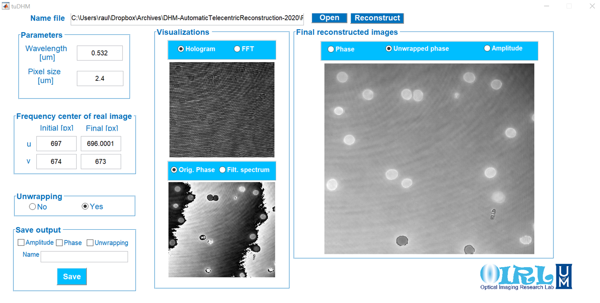

## tuDHM
### Fast automatic reconstruction method for quantitative phase images with reduced phase perturbations in off-axis digital holographic microscopy (DHM)

tuDHM is an algorithm to recover the complex object information for a single-shot digital holographic microscope (DHM) operating in the telecentric regimen. The algoritm is based on the minimization of a cost function that finds the best numerical conjugated reference beam to compensate the filtered object spectrum, eliminating any undesired phase perturbation due to the tilt between the reference and object waves. 

<p align="center">

</p>


### Methods of use

We have developed two implementations for tuDHM. A raw version for developers and a GUI user-friendly version.

### raw tuDHM 

This version is addressed to developers or imaging researchers with MATLAB knowledge. The version contain seven function where the main function is called tuDHM.m To work with `tuDHM.m` the user should read the hologram, and input the initial parameters [lambda, pixel sizes in both axis (x,y)]. For more information about the use of raw tuDHM, please dowload the manual.


### tuDHM GUI
This version contains a GUI friendly that is focus for anyone that required obtain the numerica phase reconstruction of holograms without knowledge of MATLAB platform. 
<p align="center">

</p>

### Manual
[Version 1.1](https://drive.google.com/drive/u/1/folders/1dx0FwzlBMjwrhQdnu3ou0NxkDV5-WbCV)

### Downloads

[raw tuDHM](https://drive.google.com/drive/folders/1JPoZdrmkjm8Ui-_fO_fzn1_BF_EVLScc)


[tuDHM GUI](https://drive.google.com/drive/folders/1zkEpbPhi_wR_qp0SdtxDds0FpgIxT7cb)


### Samples

We have available two holograms: samples of [RBC](https://drive.google.com/file/d/1LImiyLWZwMq0-vV7oSU8htI50-COFkGx/view?usp=sharing), and 
[Drosophila](https://drive.google.com/drive/u/1/folders/1oSrxLRunNBb1ITnn8Pb2pMWxAuLrV2Qb).


```markdown
Parameters RBC cells
wavelength: 0.532um
pixel size: 2.4um

Parameters USAF test target
wavelength: 0.632um
pixel size: 6.9um
```

### Funding
This project has received funding from the University of Memphis


### Credits
* tuDHM is developed in MATLAB (2020). version 7.10.0 (R2020a). Natick, Massachusetts: The MathWorks Inc.

* For the unwrapping step, tuDHM implements the code developed by *M.A. Herraez et. al.* and implemented by *M. F. Kasim*

M. A. Herraez, D. R. Burton, M. J. Lalor, and M. A. Gdeisat, "Fast two-dimensional phase-unwrapping algorithm based on sorting by reliability following a noncontinuous path", Applied Optics, Vol. 41, Issue 35, pp. 7437-7444 (2002).  

M. F. Kasim, "Fast 2D phase unwrapping implementation in MATLAB" [unwrapping](https://github.com/mfkasim91/unwrap_phase/).  


### Citation
If using tuDHM for publication, please kindly cite the following: R. Castaneda and A. Doblas, "Fast-iterative automatic reconstruction method for quantitative phase images with reduced phase perturbations in off-axis digital holographic microscopy," Applied Optics, _under review_ (2021).


### Support or Contact

| Researcher  | email | Google Scholar | ResearchGate |
| ------------- | ------------- |-------------| -------------|
| Raul Castaneda | *rcstdq@memphis.edu* | [RaulGoogle](https://scholar.google.com/citations?user=RBtkL1oAAAAJ&hl=en) | [RaulResearch](https://www.researchgate.net/profile/Raul_Castaneda_Quintero)
| Ana Doblas| *adoblas@memphis.edu* | [AnaGoogle](https://scholar.google.es/citations?user=PvvDEMYAAAAJ&hl=en) | [AnaResearch](https://www.researchgate.net/profile/Ana_Doblas2) 

The Principal Investigator (PI) of OIRL and tuDHM project is Dr. Ana Doblas 

Please visit OIRL website for learning more about our different projects [https://sites.google.com/view/oirl/home]
