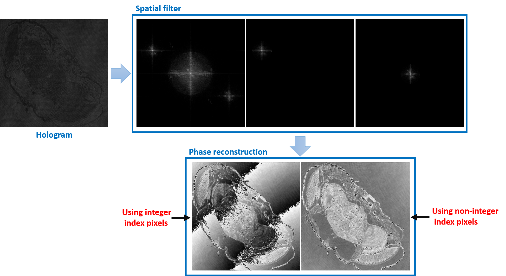
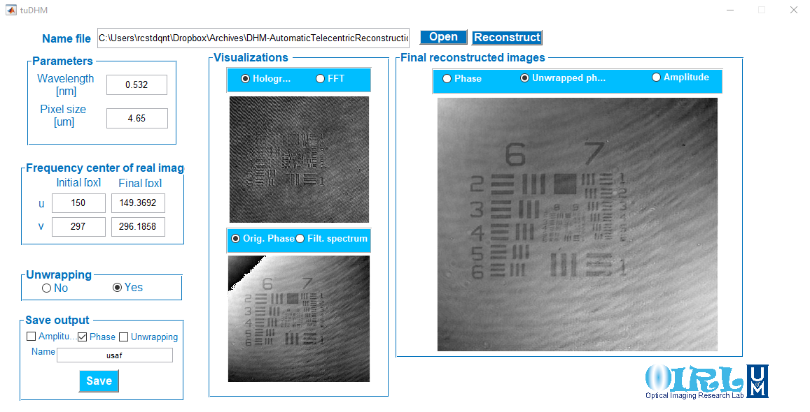

## tuDHM
### Fast, automatic and accurate method 

tuDHM is an algorithm to recover the complex object information for a single-shot digital holographic microscope (DHM) operating in the telecentric regimen. The algoritm is based on the minimization of a cost function that finds the best numerical conjugated reference beam to compensate the filtered object information, eliminating any undesired phase perturbation due to the tilt between the reference and object waves. 

<p align="center">

</p>


### Methods of use

We have developed two implementations for tuDHM. A raw version for developers and a GUI user-friendly version.

### raw tuDHM 

This version is addressed to developers or imaging researchers with MATLAB knowledge. The version contain seven function where the main function is called tuDHM.m To work with `tuDHM.m` the user should read the hologram, and input the initial parameters [lambda, pixel sizes in both axis (x,y)]. For more information about the use of raw tuDHM, please dowload the manual.


### tuDHM GUI
This version contains a GUI friendly that is focus for anyone that required obtain the numerica phase reconstruction of holograms without knowledge of MATLAB platform. 
<p align="center">

</p>

### Manual
[Version 1.1](https://drive.google.com/file/d/15XhSz9R1HQYQ7RUuUUGRnO17uYsaBXE5/view?usp=sharing)

### Downloads

[raw tuDHM]


[tuDHM GUI]


### Samples

We have available two holograms: samples of [glioblastoma cells](https://drive.google.com/file/d/1LImiyLWZwMq0-vV7oSU8htI50-COFkGx/view?usp=sharing), and 
[USAF test target](https://drive.google.com/file/d/1pKlpgoJUn06Pd1NKER-GdoZxdE21T_kk/view?usp=sharing).


```markdown
Parameters glioblastoma cells
wavelength: 0.532nm
pixel size: 2.4um

Parameters USAF test target
wavelength: 0.532nm
pixel size: 4.65um
```

### Funding
This project has received funding from the University of Memphis


### Credits
* tuDHM is developed in MATLAB (2020). version 7.10.0 (R2020a). Natick, Massachusetts: The MathWorks Inc.

* For the unwrapping step, tuDHM implements the code developed by *M.A. Herraez et.al.* 

M. A. Herraez, D. R. Burton, M. J. Lalor, and M. A. Gdeisat, "Fast two-dimensional phase-unwrapping algorithm based on sorting by reliability following a noncontinuous path", Applied Optics, Vol. 41, Issue 35, pp. 7437-7444 (2002).  

M. F. Kasim, "Fast 2D phase unwrapping implementation in MATLAB" [unwrapping](https://github.com/mfkasim91/unwrap_phase/).  


### Citation
If using tuDHM for publication, please kindly cite the following: R. Castaneda and A. Doblas, "Fast and automatic algorithm to universal recovery of the quantitative phase distribution in digital holographic microscopy," IEEE


### Support or Contact

| Researcher  | email | Google Scholar | ResearchGate |
| ------------- | ------------- |-------------| -------------|
| Raul Castaneda | *rcstdq@memphis.edu* | [RaulGoogle](https://scholar.google.com/citations?user=RBtkL1oAAAAJ&hl=en) | [RaulResearch](https://www.researchgate.net/profile/Raul_Castaneda_Quintero)
| Ana Doblas| *adoblas@memphis.edu* | [AnaGoogle](https://scholar.google.es/citations?user=PvvDEMYAAAAJ&hl=en) | [AnaResearch](https://www.researchgate.net/profile/Ana_Doblas2) |


The main researcher of tuDHM project is Ana Doblas 
